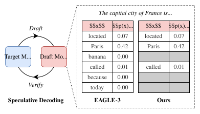
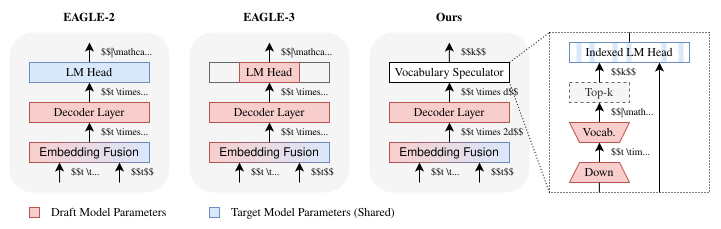

# SpecVocab

This is the official repository for the paper [Speculative Decoding with a Speculative Vocabulary](https://arxiv.org/abs/2602.13836), published in the [Findings of ACL 2026](https://aclanthology.org/2026.findings-acl.2000/).

## Abstract

> Speculative decoding has rapidly emerged as a leading approach for accelerating language model (LM) inference, as it offers substantial speedups while yielding identical outputs. This relies upon a small draft model, tasked with predicting the outputs of the target model. State-of-the-art speculative decoding methods use a draft model comprising a single decoder layer and output embedding matrix, with the latter dominating drafting time for the latest LMs. Recent work has sought to address this output distribution bottleneck by reducing the vocabulary of the draft model. While this can improve throughput, it compromises speculation effectiveness when the target token is out-of-vocabulary. In this paper, we argue for vocabulary speculation as an alternative to a reduced vocabulary. We propose SpecVocab, an efficient and effective method that selects a vocabulary subset per decoding step. Across a variety of tasks, we show that SpecVocab can achieve a higher acceptance length than state-of-the-art speculative decoding method, EAGLE-3. Notably, this yields up to an 8.1% increase in average throughput over EAGLE-3.

## Overview

In the EAGLE-3 speculative decoding framework, the majority of drafting time is spent computing the output distribution over the target vocabulary. While recent methods mitigate this bottleneck by using a fixed vocabulary subset, out-of-vocabulary tokens are rejected, harming acceptance length and therefore throughput.

The aim of *vocabulary speculation* is to compute the output distribution for only a contextually relevant subset of the vocabulary at each decoding step. This reduces the cost of computing the output distribution while better preserving the quantity of accepted draft tokens.

<p align="center">
  
</p>

SpecVocab introduces a *Vocabulary Speculator* module that speculates on which subset of the vocabulary to use at each decoding step. This differs from EAGLE-2, which uses the full target vocabulary, and EAGLE-3, which uses a fixed subset.

<p align="center">
  
</p>

### Key Results

SpecVocab achieves substantial gains in *throughput* over an EAGLE-3 baseline, as benchmarked on an NVIDIA H100 GPU.

<div align="center">

| Model | Average | Maximum |
| :-- | --: | --: |
| OLMo 2 1B | 5.0% | 8.0% |
| OLMo 2 7B | 8.1% | 11.0% |
| Qwen3 4B | 5.0% | 9.5% |
| Qwen3 8B | 4.3% | 6.2% |

</div>

## Getting Started

This repository provides an implementation of SpecVocab, along with modified versions of [SGLang](https://github.com/sgl-project/sglang) for inference support and [SpecForge](https://github.com/sgl-project/SpecForge) for draft model training.

The typical workflow is:
1. Generate draft model training data.
2. Train an EAGLE-3 draft model.
3. Benchmark the draft model throughput with SGLang.

### Installation

```shell
git clone --recursive https://github.com/SamsungLabs/SpecVocab

cd SpecVocab
uv sync
```

This project uses [uv](https://docs.astral.sh/uv/) for dependency management. The `SGLang` and `SpecForge` packages are installed from the forks that are included as submodules.

### Draft Model Variants

SpecVocab supports three draft model configurations, each defined by a JSON configuration file in `configs`:

| Variant | Configuration Suffix | Description |
|---|---|---|
| **EAGLE-3** (Reduced Vocabulary) | `-eagle3` | Standard EAGLE-3 draft model with a reduced vocabulary (`draft_vocab_size: 32000`). |
| **Tied** (Full Vocabulary) | `-tied-eagle3` | EAGLE-3 draft model with the LM head tied to the target model (`draft_vocab_size: null`). Identical vocabulary to the target model. |
| **SpecVocab** (Speculative Vocabulary) | `-specvocab-eagle3` | EAGLE-3 draft model with a `VocabularySpeculator` module. Identical vocabulary to the target model. |

For example, for Qwen3-8B, the configurations are:
- `configs/Qwen3-8B-eagle3.json` (Standard EAGLE-3 with a reduced vocabulary of 32K tokens).
- `configs/Qwen3-8B-tied-eagle3.json` (EAGLE-3 with a full vocabulary).
- `configs/Qwen3-8B-specvocab-eagle3.json` (EAGLE-3 with a speculative vocabulary).

#### SpecVocab Configuration

The SpecVocab configuration files include a `vocabulary_speculator` dictionary for the vocabulary speculation module:

| Configuration Field | Description |
|---|---|
| `intermediate_size` | Intermediate dimensionality of the vocabulary speculator ($d'$). For example, 512 for Qwen3-8B, which is 1/8 of the hidden size. |
| `num_candidate_tokens` | Number of candidate tokens ($k$) selected per decoding step. Defaults to 2048. |

### Supported Models

Configuration files are provided for the following target models:

| Model | Sizes |
|---|---|
| Qwen3 | 4B, 8B |
| OLMo 2 Instruct | 1B, 7B |

## Usage

### Training

#### 1. Prepare Training Data

Generate training data from a supported dataset. You can either use existing prompt-response pairs or synthesize responses from the target model.

We recommend using synthetic responses from the target model as this offers better performance. However, we note that this one-off data generation step is computationally expensive.

**Synthesizing responses with the target model:**

```shell
uv run -m specvocab.generate_data \
  Qwen/Qwen3-8B \
  ultrachat \
  output/data/Qwen3-8B_ultrachat.parquet \
  --synthesize \
  --max_length 2048
```

**Using existing data:**

```shell
uv run -m specvocab.generate_data \
  Qwen/Qwen3-8B \
  ultrachat \
  output/data/Qwen3-8B_ultrachat.parquet
```

#### 2. Train the Draft Model

Train a draft model by supplying a JSON configuration file via `--draft-model-path`.

```shell
uv run torchrun --standalone --nproc_per_node gpu \
  -m specvocab.train \
  --target-model-path Qwen/Qwen3-8B \
  --draft-model-path configs/Qwen3-8B-specvocab-eagle3.json \
  --data-path output/data/Qwen3-8B_ultrachat.parquet \
  --output-path output/models/Qwen3-8B_ultrachat_specvocab \
  --train-steps 800000 \
  --per-device-batch-size 2 \
  --aux-loss-weight 0.1
```

#### 3. (Optional) Vocabulary Pruning

For the reduced-vocabulary FR-Spec/VocabTrim baselines, compute token frequencies and prune the vocabulary. This requires a draft model trained using one of the `-tied` configuration files.

```shell
# Compute token frequencies from a corpus.
uv run -m specvocab.utils.compute_frequencies \
  --model-path Qwen/Qwen3-8B \
  --dataset-path cerebras/SlimPajama-627B \
  --output-path output/frequencies/Qwen3-8B_SlimPajama-627B.txt

# Prune the draft model vocabulary.
uv run -m specvocab.utils.prune_vocabulary \
  --target-model-path Qwen/Qwen3-8B \
  --draft-model-path output/models/Qwen3-8B_ultrachat_tied \
  --frequencies-path output/frequencies/Qwen3-8B_SlimPajama-627B.txt \
  --output-path output/models/Qwen3-8B_ultrachat_tied_SlimPajama-627B-32000 \
  --vocab-size 32000
```

### Benchmarking

After training, end-to-end inference throughput can be benchmarked with SGLang.

**Benchmark with speculative decoding:**

```shell
uv run -m specvocab.benchmark \
  --model-path Qwen/Qwen3-8B \
  --speculative-draft-model-path output/models/Qwen3-8B_ultrachat_specvocab \
  --speculative-algorithm EAGLE3 \
  --speculative-vocabulary-num-candidates 2048 \
  --benchmark-name specbench \
  --output-path output/results/specvocab.json \
  --batch-size 1
```

**Benchmark the target model without speculative decoding (baseline):**

```shell
uv run -m specvocab.benchmark \
  --model-path Qwen/Qwen3-8B \
  --benchmark-name specbench \
  --output-path output/results/baseline.json \
  --batch-size 1
```

## Project Structure

### SpecVocab

This project is organized as a Python package under `src/specvocab/`, with the following structure:

```
specvocab/
├── configs/
├── src/specvocab/
│   ├── benchmark.py
│   ├── generate_data.py
│   ├── train.py
│   ├── training_data.py
│   └── utils/
│       ├── benchmark_kernel.py
│       ├── compute_frequencies.py
│       └── prune_vocabulary.py
├── sglang_fork/
├── specforge_fork/
├── pyproject.toml
└── uv.lock
```

### SGLang

The `sglang_fork/` directory contains a fork of [SGLang](https://github.com/sgl-project/sglang) (v0.5.5) with the following modifications:

* Support for SpecVocab inference via the `VocabularySpeculator` module, including a fused kernel for candidate logits computation.
* Support for EAGLE-3 speculative decoding with OLMo 2 models.

The following server arguments have been added to SGLang:

| SGLang Argument | Description |
|---|---|
| `--speculative-vocabulary-num-candidates` | Override the number of candidate tokens ($k$) defined in the draft model configuration (`vocabulary_speculator.num_candidate_tokens`). |
| `--speculative-vocabulary-disable-kernel` | Disable the SpecVocab fused candidate logits kernel. |

Modified files (relative to upstream SGLang v0.5.5):

```
sglang_fork/
├── python/sglang/srt/
│   ├── layers/
│   │   ├── logits_processor.py
│   ├── model_executor/
│   │   ├── forward_batch_info.py
│   │   └── model_runner.py
│   ├── models/
│   │   ├── llama_eagle3.py
│   │   └── olmo2.py
│   ├── server_args.py
│   └── speculative/
│       ├── eagle_draft_extend_cuda_graph_runner.py
│       └── eagle_worker.py
└── test/srt/
    └── test_fused_batched_gather_dot.py
```

### SpecForge

The `specforge_fork/` directory contains a fork of [SpecForge](https://github.com/sgl-project/SpecForge) (v0.1.1) including the following modifications:

* Support for the `VocabularySpeculator` module from SpecVocab, trained via an auxiliary loss.
* Support for training draft models with an LM head tied to the target model (`draft_vocab_size: null`).

Modified files (relative to upstream SpecForge v0.1.1):

```
specforge_fork/
└── specforge/
    ├── core/
    │   └── eagle3.py
    └── modeling/
        ├── auto.py
        ├── draft/
        │   └── llama3_eagle.py
        └── target/
            └── target_head.py
```

## Acknowledgements

This project builds upon the [SGLang](https://github.com/sgl-project/sglang) inference framework and the [SpecForge](https://github.com/sgl-project/SpecForge) draft model training framework. We thank the authors and contributors of these projects.

## Citation

```bibtex
@inproceedings{williams-etal-2026-speculative,
    title = "Speculative Decoding with a Speculative Vocabulary",
    author = "Williams, Miles and Kwon, Young D. and Li, Rui and Kouris, Alexandros and Venieris, Stylianos I.",
    editor = "Liakata, Maria and Moreira, Viviane P. and Zhang, Jiajun and Jurgens, David",
    booktitle = "Findings of the {A}ssociation for {C}omputational {L}inguistics: {ACL} 2026",
    month = jul,
    year = "2026",
    address = "San Diego, California, United States",
    publisher = "Association for Computational Linguistics",
    url = "https://aclanthology.org/2026.findings-acl.2000/",
    doi = "10.18653/v1/2026.findings-acl.2000",
    pages = "40240--40254",
    ISBN = "979-8-89176-395-1"
}
```

## License

SpecVocab is licensed under the [Creative Commons Attribution-NonCommercial-ShareAlike 4.0 International License](https://creativecommons.org/licenses/by-nc-sa/4.0/).
See [LICENSE](LICENSE) for details.
